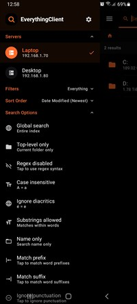
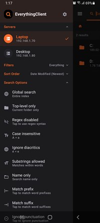
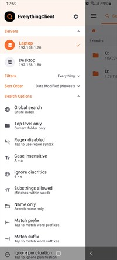
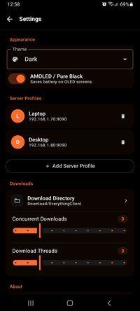
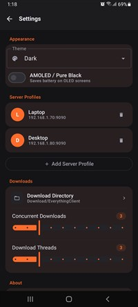
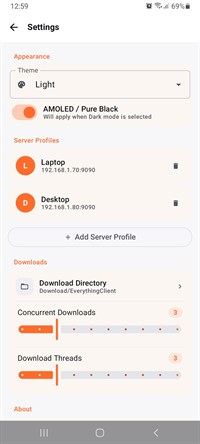

# EverythingClient

An Android frontend client for browsing and downloading files from an Everything HTTP server, with a fast, modern UI.

This project was vibe coded using Claude, Codex, and Gemini.

## Everything Server (by voidtools)
Everything is a fast filename search engine for Windows by voidtools.
Official links:
- [Everything (voidtools)](https://www.voidtools.com/support/everything/index.html)
- [Everything HTTP Server docs](https://www.voidtools.com/en-au/support/everything/http/)
- [How to setup the plugin](https://voidtools.com/support/everything/options/#http_server)

## Features
- Fast search across indexed files with filter and sort controls.
- Scope search to current location or search globally.
- Queue downloads with progress, pause, and resume support.
- Dedicated queue screen for active, paused, and completed items.
- Multi-part downloads to improve throughput on large files.
- Server profiles with quick switching and connection testing.
- Download path selection with Storage Access Framework support.
- Theme options including light, dark, and AMOLED variants.

## Tech
- Kotlin + Jetpack Compose
- Hilt for DI
- Paging 3 for large result sets

## Screenshots
<table>
  <tr>
    <td>
      
    </td>
    <td>
      
    </td>
    <td>
      
    </td>
  </tr>
  <tr>
    <td>
      
    </td>
    <td>
      
    </td>
    <td>
      
    </td>
  </tr>
  <tr>
    <td>
      
    </td>
    <td>
      
    </td>
    <td>
      
    </td>
  </tr>
  <tr>
    <td>
      
    </td>
    <td>
      
    </td>
    <td>
      
    </td>
  </tr>
</table>

## Build
1. Open the project in Android Studio.
2. Sync Gradle.
3. Generate APK.

## License
MIT License.
