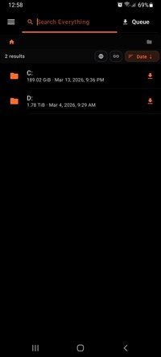
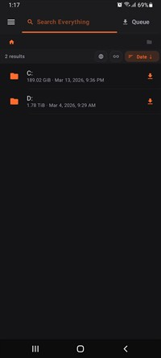
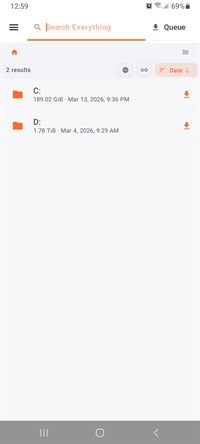
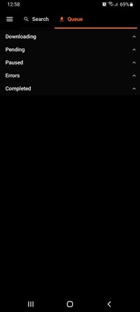
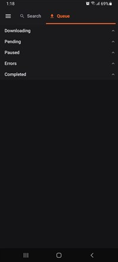
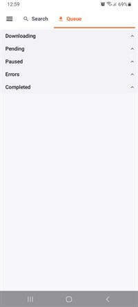

<h1 style="text-align: center;">
  
  EverythingClient
</h1>

  An Android frontend client for browsing and downloading files from an Everything HTTP server, with a fast, modern UI.

---

## Disclaimer
This project was vibe coded using Claude, Codex, and Gemini.

## Everything Server (by voidtools)
Everything is a fast filename search engine for Windows by voidtools.
Official links:
- [Everything (voidtools)](https://www.voidtools.com/support/everything/index.html)
- [Everything HTTP Server docs](https://www.voidtools.com/en-au/support/everything/http/)
- [How to setup the plugin](https://voidtools.com/support/everything/options/#http_server)

## Features
- **Fast Search**: Across indexed files with filter and sort controls.
- **Scoped Search**: Search within the current location or globally.
- **Advanced Downloads**: Queue downloads with progress, pause, and resume support.
- **Multi-part Downloads**: Improve throughput on large files.
- **Dedicated Queue**: Manage active, paused, and completed items.
- **Server Profiles**: Quick switching and connection testing.
- **Modern UI**: Light, Dark, and AMOLED theme variants.

## Tech Stack
- **Kotlin + Jetpack Compose**
- **Hilt** (Dependency Injection)
- **Paging 3** (Handling large result sets)

## Screenshots
<table style="margin-left: auto; margin-right: auto;">
  <tr>
    <td></td>
    <td></td>
    <td></td>
  </tr>
  <tr>
    <td style="text-align: center;">Search (AMOLED)</td>
    <td style="text-align: center;">Search (Dark)</td>
    <td style="text-align: center;">Search (Light)</td>
  </tr>
  <tr>
    <td></td>
    <td></td>
    <td></td>
  </tr>
  <tr>
    <td style="text-align: center;">Queue (AMOLED)</td>
    <td style="text-align: center;">Queue (Dark)</td>
    <td style="text-align: center;">Queue (Light)</td>
  </tr>
</table>

## Build
1. Open the project in Android Studio.
2. Sync Gradle.
3. Generate APK.

## License
MIT License.